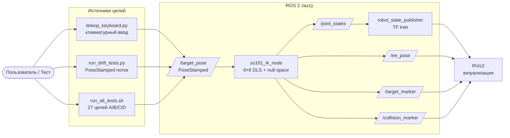

# SO-101 IK (ROS 2 Jazzy + Pinocchio + RViz2)

Узел обратной кинематики для робота SO-ARM101, работающий в Docker (ROS 2 Jazzy + RViz2 + Pinocchio).
Поддерживает **6D IK** (позиция + ориентация), **ограничения скорости и границ суставов через CBF**, **сглаживатель min-jerk**, **барьер самоколлизий**.

URDF: `/workspace/SO-ARM100/Simulation/SO101/so101_new_calib.urdf` (монтируется в контейнер на этапе сборки образа).

**См. также**:
- [`docs/topics.md`](docs/topics.md) — форматы ROS 2 топиков
- [`docs/diagrams.md`](docs/diagrams.md) — Mermaid-диаграммы (потоки данных, state machine, архитектура)
- [`docs/sequence.md`](docs/sequence.md) — sequence diagram потока /target_pose → /joint_states
- [`docs/robot_state_publisher.md`](docs/robot_state_publisher.md) — описание компонента robot_state_publisher

---

- [0. Быстрый старт](#0-быстрый-старт)
- [1. Структура проекта](#1-структура-проекта)
- [2. Поток данных через IK-узел](#2-поток-данных-через-ik-узел)
- [3. Запуск](#3-запуск)
  - [Сборка образа](#сборка-образа)
  - [Запуск контейнера (с X11 для RViz2)](#запуск-контейнера-с-x11-для-rviz2)
  - [Запуск стенда (RViz + IK + robot_state_publisher)](#запуск-стенда-rviz--ik--robot_state_publisher)
  - [Перейти в контейнер для работы с IK-нодой (вручную или скриптом из /scripts)](#перейти-в-контейнер-для-работы-с-ik-нодой-вручную-или-скриптом-из-scripts)
- [4. Публикация целей (6D PoseStamped)](#4-публикация-целей-6d-posestamped)
  - [Тесты IK](#тесты-ik)
    - [27 различных поз](#27-различных-поз)
    - [Дрейф-тест с помощью фигур](#дрейф-тест-с-помощью-фигур)
    - [Клавиатурный телеоп (Phase 5)](#клавиатурный-телеоп-phase-5)
- [5. Наблюдение в rviz2 и через ros-топики](#5-наблюдение-в-rviz2-и-через-ros-топики)
  - [Цвета маркеров (статусы IK)](#цвета-маркеров-статусы-ik)
- [6. Настройка в рантайме](#6-настройка-в-рантайме)
- [7. Алгоритм](#7-алгоритм)
- [8. Улучшения IK](#8-улучшения-ik)
- [9. Самоколлизии](#9-самоколлизии)
- [10. Известные ограничения](#10-известные-ограничения)

---

## 0. Быстрый старт
Чтобы как можно быстрее запустить демонстрацию (например, движения по кругу в плоскости стола) ознакомьтесь со следующими разделами:  
[Запуск](#3-запуск) -> [Тест с помощью фигур](#дрейф-тест-с-помощью-фигур)  
Для понимания, где что находится полезны:  
[Структура проекта](#1-структура-проекта)  
[Поток данных через IK-узел](#2-поток-данных-через-ik-узел)

---

## 1. Структура проекта

```
rviz2-docker/
├── Dockerfile                 # COPY app + scripts, сборка Pinocchio
├── README.md                  # этот файл
├── app/
│   ├── CMakeLists.txt
│   ├── package.xml
│   ├── so101-ik.cpp            # офлайн-пример без ROS
│   ├── so101-ik-node.cpp       # основной IK-узел (6D + коллизии)
│   ├── launch/
│   │   └── so101_ik.launch.py  # robot_state_publisher + ik + rviz
│   └── config/
│       └── so101.rviz          # конфиг RViz (Interact активен по умолчанию)
├── scripts/
│   ├── run_all_tests.sh        # 27 тестов A/B/C/D (6D PoseStamped)
│   ├── run_drift_tests.py      # тест дрейфа в замкнутом цикле (с --publish-dt)
│   └── teleop_keyboard.py      # автономный узел на Python для ручного управления
└── docs/
    ├── topics.md                       # форматы ROS 2 топиков + примеры JSON
    ├── diagrams.md                     # Mermaid-диаграммы (data flow, state machine, архитектура)
    ├── sequence.md                     # sequence diagram /target_pose → /joint_states
    ├── sequence.puml                   # PlantUML-версия той же диаграммы
    ├── sequence.svg                    # отрендеренный SVG
    └── robot_state_publisher.md        # описание robot_state_publisher
```

URDF и ассеты подгружаются в `/workspace/SO-ARM100/...` на этапе сборки образа (см. `Dockerfile`, шаг `git clone https://github.com/TheRobotStudio/SO-ARM100.git`).

---

## 2. Поток данных через IK-узел

Для общего представления о принципе работы схемы и о том, куда можно подключиться для публикации своих точек и снятия углов суставов после IK.  
Оригинал диаграммы см. в [/docs/diagrams.md](/docs/diagrams.md#1-поток-данных-ik-узла). Диаграмма может обновиться!


## 3. Запуск

### Сборка образа
```bash
docker build -t so101-ik:latest .
```

### Запуск контейнера (с X11 для RViz2)
```bash
xhost +local:docker    # один раз на хосте

docker run --rm --net=host \
  --env="DISPLAY=$DISPLAY" \
  --env="QT_X11_NO_MITSHM=1" \
  --volume="/tmp/.X11-unix:/tmp/.X11-unix:rw" \
  --name so101-dev -it so101-ik:latest
```

### Запуск стенда (RViz + IK + robot_state_publisher)
```bash
ros2 launch so101_ik so101_ik.launch.py
```

Переменные окружения (`/opt/ros/jazzy/setup.bash`, `install/setup.bash`) прописаны в `~/.bashrc` образа — не требуется вручную.

### Перейти в контейнер для работы с IK-нодой (вручную или скриптом из /scripts)
```bash
docker exec -it so101-dev /bin/bash
```
Подробнее о публикации и работе со скриптами см. ниже.

---

## 4. Публикация целей (6D PoseStamped)

**Топик**: `/target_pose`
**Тип**: `geometry_msgs/msg/PoseStamped`
**Система координат**: `base_link`

```bash
ros2 topic pub --once /target_pose geometry_msgs/msg/PoseStamped \
  '{header: {frame_id: base_link},
    pose: {position: {x: 0.25, y: 0.05, z: 0.10},
           orientation: {x: 0.0, y: 0.0, z: 0.0, w: 1.0}}}'
```

`orientation` — кватернион `(x, y, z, w)`. Единичный `w=1, x=y=z=0` → только управление позицией (обратная совместимость).
Для 6D управления — задавайте неединичный кватернион.

### Тесты IK
#### 27 различных поз

```bash
bash scripts/run_all_tests.sh           # внутри контейнера
```

| Группа | Тестов | Ожидаемое поведение |
|--------|--------|---------------------|
| **A** — внутри рабочей области | 6 | 🟢 `IK converged`, погрешность ≈ 0.0001 |
| **B** — за пределами | 5 | 🟠 проекция; EE близко к границе |
| **C** — у границы | 2 | 🟢 или 🟡 `IK approximate` |
| **D** — серии плавных движений | 14 (1 + 5 + 8) | 🟢 все |

#### Дрейф-тест с помощью фигур
end_effector движется по траекториям квадрата и круга.
Help может быть вызван:
```bash
./run_drift_tests.py --help
usage: run_drift_tests.py [-h] [--shape {circle-xz,circle-xy,square-xy,all}]
                          [--n-points N_POINTS] [--n-per-side N_PER_SIDE]
                          [--threshold THRESHOLD] [--baseline]
                          [--center X Y Z] [--settle-sec SETTLE_SEC]
                          [--publish-dt PUBLISH_DT]

Drift-free tests for SO-101 IK (rviz2-docker).

options:
  -h, --help            show this help message and exit
  --shape {circle-xz,circle-xy,square-xy,all}
  --n-points N_POINTS   Number of points for circle-* (default 16)
  --n-per-side N_PER_SIDE
                        Number of points per side for square-xy (default 5)
  --threshold THRESHOLD
                        Drift threshold in radians (default 0.05 ≈ 3°)
  --baseline            Baseline mode: invert verdict — PASS if drift EXCEEDS
                        threshold (criterion not yet active)
  --center X Y Z        Loop center in base_link frame (default 0.25 0.0 0.0)
  --settle-sec SETTLE_SEC
                        Seconds to settle at start pose (default 1.5)
  --publish-dt PUBLISH_DT
                        Seconds between target publishes during loop walk
                        (default 2.5 — must exceed robot
                        interp_steps/publish_rate)
```

Запустить все доступные в скрипте фигуры:
```bash
python3 scripts/run_drift_tests.py
```

Запустить движение по кругу в плоскости base_link (это ближайшая к столу деталь роборуки):
```bash
./run_drift_tests.py --shape circle-xy --center 0.24 0.0 0.0 --n-points 72 --publish-dt 1.2 --settle-sec 2.0
```


### Клавиатурный телеоп (Phase 5)

Автономный узел на Python для ручного тестирования:
```bash
python3 scripts/teleop_keyboard.py
```
внутри контейнера. Или выполнить на хосте для входа в контейнер с последующим запуском телеопа:
```
docker exec -it so101-dev bash -c "python3 /workspace/ros2_ws/src/so101_ik/scripts/teleop_keyboard.py"
```

Клавиши:
```
T/G: ±X    A/D: ±Y    W/S: ±Z           (перемещение)
J/L: рыскание   I/K: тангаж U/O: крен   (вращение)
+/-: шаг 1мм/10мм                      (перемещение)
[/]: шаг 1°/10°                          (вращение)
R: сброс в домашнюю позу   H: справка   Q: выход
```

---

## 5. Наблюдение в rviz2 и через ros-топики

| Топик | Тип | Описание |
|-------|-----|----------|
| `/joint_states` | `sensor_msgs/JointState` | Текущие углы суставов (для `robot_state_publisher`) |
| `/ee_pose` | `geometry_msgs/PoseStamped` | Реальная поза EE после IK (включая ориентацию) |
| `/target_marker` | `visualization_msgs/Marker` | Сфера-маркер цели; цвет = статус IK |
| `/collision_marker` | `visualization_msgs/Marker` | Красная сфера при обнаружении самоколлизии |
| `/tf`, `/tf_static` | `tf2_msgs/TFMessage` | Дерево трансформаций |

### Цвета маркеров (статусы IK)

| Цвет | Статус | Условие |
|------|--------|---------|
| 🟢 зелёный | `Converged` | взвешенная погрешность < `ik_eps_visual` |
| 🟡 жёлтый | `Approximate` | взвешенная погрешность в [eps_visual, 0.05] |
| 🟠 оранжевый | `Projected` | цель была вне рабочей области, спроецирована |
| 🔴 красный | `Failed` | ни один из 5+1 рестартов не дал нужной точности |

---

## 6. Настройка в рантайме

```bash
ros2 param list /so101_ik_node
ros2 param set /so101_ik_node weight_pref 0.3
ros2 param set /so101_ik_node weight_orient 0.5       # вес ориентации в 6D задаче
ros2 param set /so101_ik_node vel_max "[2.0, 2.0, ...]" # увеличить ограничение скорости
```

Полный список параметров — в `app/so101-ik-node.cpp` (`declare_parameter` в конструкторе).

| Параметр | Default | Назначение |
|----------|---------|------------|
| `publish_rate` | 50.0 | Гц, таймер для `joint_states` |
| `interp_steps` | 100 | шагов интерполяции (min-jerk) |
| `ik_max_iter` | 500 | макс. итераций IK |
| `perturb_scales` | [0.05, 0.15, 0.30, 0.50, 0.80] | амплитуды мультистарта |
| `auto_flip_restart` | true | отражение shoulder_pan для целей за базой |
| `ik_eps` | 1e-4 | сходимость по взвешенной норме (внутренний критерий для IK) |
| `ik_eps_visual` | 0.01 | порог 🟢 для отображения статуса `Converged` (только визуальный, не влияет на IK) |
| `ik_dt`, `ik_dt_min`, `ik_dt_max` | 0.1, 0.05, 0.5 | адаптивный шаг |
| `ik_damp` | 1e-6 | DLS демпфирование базовое |
| `ik_man_k`, `ik_man_thresh` | 1e-4, 1e-4 | адаптивное демпфирование по μ |
| `weight_jc`, `weight_man`, `weight_prev`, `weight_pref`, `weight_drift` | 0.5, 0.2, 0.3, 0.5, 0.1 | компоненты нуль-пространства |
| `preferred_q` | [0.0, -0.3, 1.0, -0.7, 0.0, 0.0] | предпочтительная поза |
| `weight_pos`, `weight_orient` | 1.0, 0.5 | веса 6D задачи |
| `vel_max` | [1.0×6] рад/с | ограничение скорости на сустав (clamp dq после IK шага) |
| `mu_boundary` | 5.0 | коэффициент границы через CBF (adaptive joint bound: `q_bound = upper - mu_boundary * (1 - μ/μ_thresh)` — чем ближе к сингулярности, тем жёстче граница) |
| `weight_collision` | 0.5 | вес барьера самоколлизий |
| `collision_d_min` | 0.005 м | минимальное расстояние между линками |
| `collision_margin` | 0.010 м | зона активации барьера |
| `ik_stuck_patience` | 40 | итераций до объявления "stuck" |
| `reach_padding` | 0.01 | отступ для проекции в рабочую область |
| `init_target_x/y/z` | 0.20, 0.0, 0.15 | начальная IK-поза при старте |

---

## 7. Алгоритм

Базовый алгоритм — **Damped Least Squares (DLS)** в операционном пространстве (CLIK), расширенный до **6D (SE(3))**:

1. Прямая кинематика `EE(q)` → `ee_pos`, `ee_rot`.
2. **6D ошибка**:
   - Позиционная: `e_pos = target_pos − ee_pos`.
   - Ориентационная: `e_rot = log3(R_target · R_currentᵀ)` (axis-angle, через обратное преобразование Родригеса).
   - `e_6d = [e_pos; e_rot]`.
3. **Обратная совместимость**: если `R_target ≈ I` (единичный кватернион), `e_rot := 0` → управление только позицией.
4. **Якобиан 6×n_v** через `getFrameJacobian(LOCAL_WORLD_ALIGNED)`.
5. **Взвешенный DLS**: `v_task = J^T · W · (W·J·J^T·W + λ²I)⁻¹ · W·e_6d`,
   где `W = diag([w_pos·I3, w_orient·I3])` (по умолчанию `w_pos = w_orient = 1.0`).
6. **Проектор на нуль-пространство** (через невзвешенный псевдообратный якобиан): `N = I − J⁺ · J`.
7. **Шаг в нуль-пространстве** — сумма аттракторов:
   ```
   z = w_jc·(q_mid−q) + w_prev·(q_start−q) [+ w_drift·(q_start−q)] +
       w_pref·(q_pref−q) + w_man·∇μ [+ w_coll·барьер коллизий]
   ```
8. **Шаг интегрирования**: `q ← integrate(q, dt · (v_task + N · z))`, затем **ограничение скорости** + **динамические границы через CBF** + клип позиции.
9. Итерации до сходимости (`‖W·e_6d‖ < ik_eps`) или исчерпания `ik_max_iter`.

---

## 8. Улучшения IK

| # | Улучшение | Функция / место | Параметры |
|---|-----------|-----------------|-----------|
| 1 | Консервативная оценка `r_max` | `computeWorkspaceRadius()` | `link_sum * 1.02`, минимум из выборки 2000 случайных конфигураций |
| 2 | Проекция недостижимой цели (по позиции) | `projectToWorkspace()` | `reach_padding` = 0.01 |
| 3 | Адаптивное демпфирование по μ (мера Йошикавы, 6D) | `solveIK()` | `ik_damp` = 1e-6, `ik_man_k` = 1e-4, `ik_man_thresh` = 1e-4 |
| 4 | Адаптивный шаг `dt` | `solveIK()` | `ik_dt` = 0.1, `ik_dt_min` = 0.05, `ik_dt_max` = 0.5 |
| 5 | Детектор застревания | `solveIK()` | `ik_stuck_patience` = 40 |
| 6 | Мультистарт с разными масштабами | `perturbConfig()` | `perturb_scales` = [0.05, 0.15, 0.30, 0.50, 0.80] |
| 7 | Рестарт с отражением shoulder_pan для целей за базой | `flipShoulderPan()` | `auto_flip_restart` = true |
| 8 | Нуль-пространство: центрирование суставов | `solveIK()` | `weight_jc` = 0.5 |
| 9 | Нуль-пространство: минимум движения | `solveIK()` | `weight_prev` = 0.3 |
| 10 | Нуль-пространство: **критерий против дрейфа** (замкнутый цикл) | `solveIK()` | `weight_drift` = 0.1 (отложено — см. §8) |
| 11 | Нуль-пространство: предпочтительная поза (локоть вниз) | `solveIK()` | `weight_pref` = 0.5, `preferred_q` = [0.0, −0.3, +1.0, −0.7, 0.0, 0.0] |
| 12 | Нуль-пространство: защита от сингулярности (градиент μ) | `numericalManipGradient()` | `weight_man` = 0.2 |
| 13 | **Ограничение скорости** на сустав (clamp `dq`) | `solveIK()` | `vel_max` = [1.0×6] рад/с |
| 14 | **Динамические границы через CBF** у лимитов | `solveIK()` | `mu_boundary` = 5.0 |
| 15 | **Барьер самоколлизий через CBF** (link-to-link) | `solveIK()` | `weight_collision` = 0.5, `collision_d_min` = 0.005 м, `collision_margin` = 0.010 м |
| 16 | 6D ошибка + взвешенный DLS (см. §1) | `solveIK()` | `weight_pos` = 1.0, `weight_orient` = 1.0 |
| 17 | Мягкая классификация результата | `solveIK()` | `ik_eps` = 1e-4, `ik_eps_visual` = 0.01 |
| 18 | **Сглаживатель min-jerk пятой степени** (интерполяция в `timerCallback`) | `timerCallback()` | `interp_steps` = 100 |

---

## 9. Самоколлизии

Пары линков для проверки (несмежные, захардкожены в `collision_pairs_`):
```
base_link      ↔ lower_arm_link, wrist_link, gripper_link
shoulder_link  ↔ lower_arm_link, wrist_link
upper_arm_link ↔ wrist_link, gripper_link
lower_arm_link ↔ gripper_link
```

Алгоритм:
- Расстояние между сферами: `d = ‖p_a − p_b‖ − (r_a + r_b)`, с захардкоженными `sphere_radii_` для каждого линка.
- На каждой итерации IK считается `d` для всех 8 пар.
- **Барьер CBF** активируется **только если** `d < collision_d_min + collision_margin`:
  - Численный градиент `∂d/∂q_i` через конечные разности.
  - Отталкивающая сила: `z += w_collision · (collision_d_min − d) · ∇d`.
- **Визуализация**: красная сфера на `/collision_marker` при обнаружении коллизии (масштаб = глубина проникновения).

---


## 10. Известные ограничения

1. **Критерий против дрейфа неэффективен при `weight_drift = 0.1`** (Phase 1.2 отложено). На замкнутой траектории в XZ-плоскости (`circle-xz`) wrist_flex дрейфит ~26° за один оборот. Причина: конкурирует с `weight_prev` за тот же вектор `(q_start − q)`. **TODO**: пересмотреть — убрать `weight_prev` или поднять `weight_drift` до 1.0+.
2. **Регрессия B4**: target `[-0.300, 0.0, 0.100]` (за base_link) рестарт с отражением занимает в ~3 раза больше времени из-за `vel_max = 1.0 рад/с`. Решается runtime-увеличением `vel_max` до 2.0+ или `ik_max_iter` до 1000.
3. **6D управление ориентацией слабое при неединичном target**. При `weight_orient = 1.0` тест поворота на 5° показал pos err 0.08, rot err 1.14 рад. Причина: для SO-101 6DOF вблизи границ рабочей области 6×6 якобиан сингулярный → решатель застревает. **Обходной путь**: упростить целевую позу (меньший поворот), или увеличить `ik_max_iter`.
4. **Аппроксимация сферами** для обнаружения коллизий — ограничивающие сферы вместо капсул. Точное обнаружение коллизий требует FCL/hpp-fcl (отложено).
5. **Численный градиент** для самоколлизий — конечные разности с h=1e-3. Шумный у сингулярностей.
6. **`preferred_q` подобран под SO-101**. Для другой морфологии манипулятора нужно пересмотреть.
7. **Начало сустава как центр линка** для проверки коллизий сферами. Радиус сферы покрывает бо́льшую область → более консервативная оценка.

---