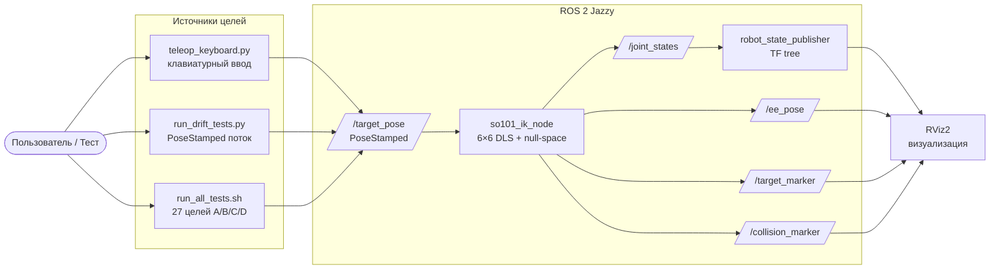
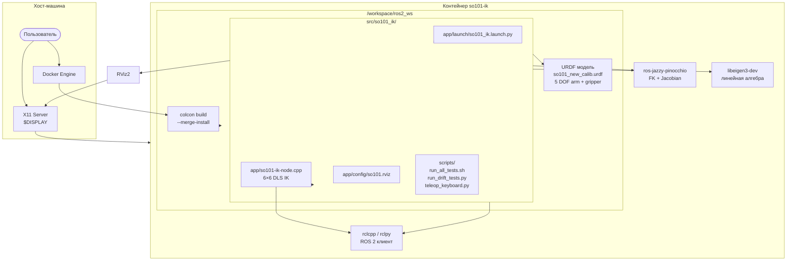

# Диаграммы SO-101 IK

Три Mermaid-диаграммы для понимания работы IK-узла.

## 1. Поток данных IK-узла



## 2. Конечный автомат одной итерации solveIK

```mermaid
stateDiagram-v2
    [*] --> WarmStart
    WarmStart: warm-start q = q_start_interp
    WarmStart --> ComputeErr: err = W @ [e_pos; e_rot]
    ComputeErr --> CheckConvergence: ‖err‖ < ik_eps?
    CheckConvergence --> Converged: да
    CheckConvergence --> BuildJacobian: нет
    BuildJacobian: J = ∂EE/∂q (6×nv)
    BuildJacobian --> CheckManip: μ = det(JJᵀ)
    CheckManip: проверка манипулятивности
    CheckManip --> Stuck: μ мал, stuck_count > patience
    CheckManip --> DLS: μ OK
    DLS: v_task = Jᵀ·W·(W·JJᵀW + λ²I)⁻¹·W·e
    DLS --> NullSpace: z = sum of attractors
    NullSpace: w_jc, w_prev, w_pref, w_man, w_drift, w_coll
    NullSpace --> Integrate: q += dt·(v_task + N·z)
    Integrate --> Clamp
    Clamp: velocity clamp + CBF bounds + position clip
    Clamp --> LoopCheck
    LoopCheck: iter < max_iter AND не застрял?
    LoopCheck --> ComputeErr: да
    LoopCheck --> Multistart: iter >= max_iter
    Multistart: perturb q, restart до 5 попыток
    Multistart --> WarmStart
    Stuck: сохранить лучшее, пробовать multistart
    Stuck --> Multistart
    Converged --> Done
    Done: опубликовать q, target_marker, ee_pose, collision_marker
    Done --> [*]
```



## 3. Системная архитектура



## Использование

### Просмотр в Markdown-рендерере (GitHub, GitLab, VS Code)

Просто откройте `app/diagrams.md` — Mermaid-блоки отрендерятся автоматически.

### Рендеринг в SVG/PNG

```bash
# Требует @mermaid-js/mermaid-cli (npm install -g @mermaid-js/mermaid-cli)
npx -p @mermaid-js/mermaid-cli mmdc -i app/diagrams.md -o app/diagrams.svg

# Или через Python (без mmdc)
python <SKILL_ROOT>/diagram-generator/scripts/render_diagram.py \
  app/diagrams.md --format svg --out app/diagrams.svg
```
